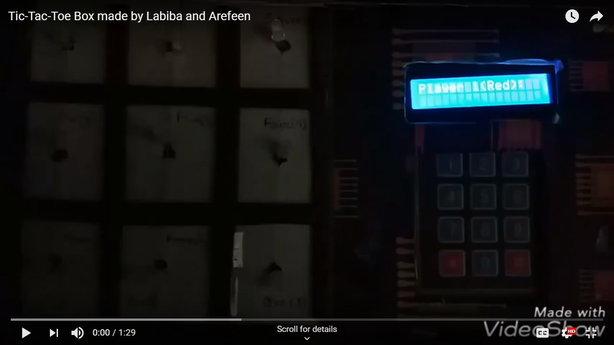

# MSD-Assignment-Tic-Tac-Toe
An Arduino implementation of Tic-Tac-Toe game. The game was an assignment of our CSE - 3216 The features we included were:
* Both players can input their name at the start of the game
* We've kept a simple AI that can predict if the match is going to be a draw or not before 2 moves in the board is empty.
* After the end of game a player can choose whether he/she wants to repeat the game or not. If not, then both players score will be shown according to the matches they played. The winner will also be declared after the rounds.

## Video

